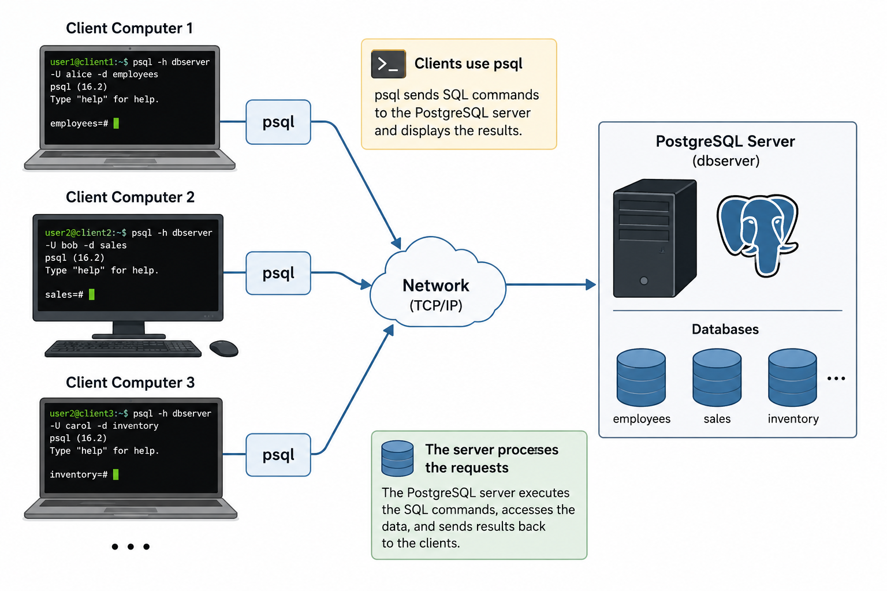

# Quick Intro
* Database management is similiar to excel spreadsheets, but scales much better, is more lightweight, its free and works well for backend integration with other applications.
* SQL: A language used to query and manage data in databases (works across systems like MySQL, PostgreSQL, Oracle, etc.).
* psql: A command-line tool (client) used to run SQL commands against a PostgreSQL database.
* PostgreSQL: A database system (DBMS) that stores and manages data. It understands SQL and is what actually runs your queries.

# Getting Started (do example of each, post instructions for each)
Options to use psql:
1. Use eniac account at hunter to interface with csci232-server. 
   * easiest to get started, realistic use case in industry 
   * you should already have an account, if you don't email me
   * con: no write access, so eventually you will have to use one of the other options for psql 
2. Download psql on computer  [LINK](https://www.postgresql.org/download/)
   * not too hard, but some additional setup is required depending on os
3. Download docker, then use psql [LINK](https://docs.docker.com/desktop/?_gl=1*1j6wwd6*_gcl_au*MTIwNzIzNzQyNS4xNzgwMzMzNTU3*_ga*MTIyNTY4MDIxLjE3ODAzMzM1NTc.*_ga_XJWPQMJYHQ*czE3ODAzMzM1NTYkbzEkZzEkdDE3ODAzMzM1NzQkajQyJGwwJGgw)
   * dont have to install psql but must install docker instead
   * Most difficult option here
   * pro: learn docker, similar to using databases on aws 
   * con: ephemeral database, must set it up each time

# Option 1 steps
* ssh into eniac -> ```ssh username@eniac.cs.hunter.cuny.edu```
* ```ssh cslab<x>``` ,where \<x\> is a number between 1 and 30
* ```psql -d postgres -U student -W -h csci232-server``` (password provided on brightspace)

# Option 3 steps
* docker + vscode setup [LINK](../../.devcontainer/readme.md) <br><br>
psql commands in docker: 
* ```pg_lsclusters``` #shows the clusters you got
* ```pg_ctlcluster 18 main start``` #start a down cluster
* ```sudo -u postgres psql #cli for psql``` 
* ```ALTER USER postgres PASSWORD 'hello1234';```
* ```\q```
* Do the Getting Data for options 2 and 3


# Getting Data for options 2 and 3
* ```psql -h localhost -U postgres```
* ```CREATE DATABASE employees;```
* ```\q```
* Find data: [LINK](https://github.com/datacharmer/test_db)
* modify line in /etc/postgresql/\<version\>/main/pg_hba.conf ```local   all             postgres                                peer``` to ```local   all             postgres                                trust```
* ```service postgresql restart```
* ```cd test_db/postgresql``` (bash)
* ```export PGUSER=postgres``` (bash)
* if windows ```sed -i 's/\r$//' load_employees_db.sh``` else: skip
* ```bash load_employees_db.sh``` (bash)
* use psql by running: ```psql -U postgres```


# What is psql?

`psql` is the interactive command-line client for PostgreSQL.

It allows users to:
- connect to a PostgreSQL database server
- execute SQL queries
- create and manage databases
- inspect tables and schemas
- import and export data

`psql` acts as a client application that communicates with a PostgreSQL server.

---

# Relationship Between PostgreSQL and psql

Think of PostgreSQL and `psql` as two separate components:

```text
PostgreSQL Server
    |
    |  (database engine storing data)
    |
psql Client
```

- PostgreSQL is the database management system itself
- `psql` is a tool used to interact with it

The PostgreSQL server:
- stores data
- processes queries
- manages transactions
- handles indexing and concurrency

The `psql` client:
- sends commands to the server
- displays results to the user

---

# Basic Database Terminology

## Server

A server is a program or computer system that provides services to other programs or computers.

In PostgreSQL, the database server:
- stores databases
- processes SQL queries
- manages users and permissions
- handles requests from clients like `psql`

The server usually runs continuously in the background.

---

# Database

A database is an organized collection of related information.

Examples:
- employee records
- customer accounts
- product inventories

A PostgreSQL server can contain multiple databases, and a single database can also be thought as a set of **tables**.

---

# Table

A table is a structure inside a database used to organize data into rows and columns.

Example:

| id | name   | major              | gpa |
|----|--------|--------------------|-----|
| 1  | Alice  | Computer Science   | 3.8 |
| 2  | Bob    | Mechanical Eng.    | 3.5 |
| 3  | Carol  | Electrical Eng.    | 3.9 |

A table is similar to a spreadsheet.

---

# Columns

Columns define the categories or attributes of the data stored in a table.

Example:

```text
emp_no
first_name
last_name
hire_date
```

Each column stores a specific type of information.

---

# Data

Data refers to the actual values stored inside the table.

Example row:

```text
10001 | Georgi | Facello | 1986-06-26
```

This row represents one employee record, and each box is a data element. 

---

# Starting psql

A common command is:

```bash
psql -U postgres
```

Where:
- `psql` starts the client
- `-U postgres` specifies the database user

You can also connect explicitly to:
- a database
- a server
- a port

Example:

```bash
psql -h localhost -p 5432 -U postgres -d employees
```

Where:
- `-h localhost` specifies the server address
- `-p 5432` specifies the server port
- `-U postgres` specifies the user
- `-d employees` specifies the database

---

# What is localhost?

`localhost` refers to your own computer.

If PostgreSQL is installed on your machine, then:

```text
localhost
```

means:
> connect to the PostgreSQL server running on this computer.

---

# What is a Port?

A port is a communication endpoint used by network applications.

PostgreSQL commonly uses:

```text
5432
```

as its default port.

Clients like `psql` use the port to communicate with the PostgreSQL server.


# psql Meta-Commands

`psql` also provides special commands called meta-commands.

These begin with a backslash (`\`).

Examples:

List databases:

```sql
\l
```

list all the users:
```sql
\du
```

Connect to another database:

```sql
\c employees
```

List tables:

```sql
\dt
```

Describe a table:

```sql
\d employees
```

Quit psql:

```sql
\q
```

These commands are part of `psql`, not standard SQL.

---

# Why psql is Important

`psql` is widely used because it:
- is lightweight
- works well remotely
- provides direct database access
- is available on Linux, macOS, and Windows
- free and open source

It is commonly used by:
- database administrators
- backend developers
- data engineers
- systems programmers

---

# Important Insight

`psql` is only a client interface.

It does not store the database itself.

The actual database engine is PostgreSQL, which runs as a background server process.



 
# SELECT

`SELECT` specifies which columns or expressions you want to retrieve from a database table.

Example:

```sql
SELECT first_name, last_name
FROM employees;
```

Meaning:

> Show me the `first_name` and `last_name` columns.

You can also select everything:

```sql
SELECT *
FROM employees;
```

`*` means:

> all columns

---

# FROM

`FROM` specifies which table the data comes from.

Example:

```sql
SELECT first_name
FROM employees;
```

Meaning:

> Retrieve `first_name` from the `employees` table.

Think of it conceptually like:

```text
SELECT what_you_want
FROM where_it_lives
```

---

# AS

`AS` creates an alias (temporary name).

It is commonly used for:
- cleaner output
- renaming columns in query results
- shortening table names

Example:

```sql
SELECT first_name AS fname,
       last_name AS lname
FROM employees;
```

Output:

```text
fname     | lname
----------+----------
Georgi    | Facello
```

Here:
- `fname` is a temporary alias for `first_name`
- `lname` is a temporary alias for `last_name`

Importantly, `AS` does not change the actual database schema or column names.
It only changes how the columns appear in the query result.

For example, after running the query above, the table still contains:

```text
first_name
last_name
```

not:

```text
fname
lname
```

`AS` can also be used with table names:

```sql
SELECT e.first_name
FROM employees AS e;
```

Here:
- `e` is a temporary shorthand alias for the `employees` table

This is especially useful in joins and complex queries.

---

# WHERE

`WHERE` filters rows.

It answers:

> Which rows should be included?

Example:

```sql
SELECT *
FROM employees
WHERE gender = 'F';
```

Meaning:

> Show only employees whose gender is F.

Another example:

```sql
SELECT first_name, hire_date
FROM employees
WHERE hire_date > '1990-01-01';
```

Meaning:

> Show employees hired after January 1, 1990.

Common operators:

| Operator | Meaning |
|---|---|
| `=` | equal |
| `!=` or `<>` | not equal |
| `>` | greater than |
| `<` | less than |
| `>=` | greater or equal |
| `<=` | less or equal |

---

# LIMIT

`LIMIT` restricts the number of rows returned.

Example:

```sql
SELECT *
FROM employees
LIMIT 5;
```

Meaning:

> Only show the first 5 rows.

This is very useful because databases can contain:
- thousands
- millions
- billions

of rows.

---

# Putting It Together

Example:

```sql
SELECT first_name AS fname,
       last_name AS lname,
       hire_date
FROM employees
WHERE gender = 'F'
LIMIT 5;
```

Step-by-step:

1. `FROM employees`
   → use the employees table

2. `WHERE gender = 'F'`
   → keep only female employees

3. `SELECT ...`
   → choose columns to display

4. `AS`
   → rename columns temporarily

5. `LIMIT 5`
   → only return 5 rows

---

# Order of evaluation and order of syntax

The clauses are read by the computer in the following order:

```text
FROM   -> get table
WHERE  -> filter rows
SELECT -> choose columns
LIMIT  -> reduce output size
```

But must be written by the human in the following order: 

```sql
SELECT emp_no,
       first_name,
       last_name
FROM employees
WHERE birth_date > '1960-01-01'
LIMIT 10;
```

Meaning:

> Show the employee number, first name, and last name of employees born after 1960, but only return 10 rows.

