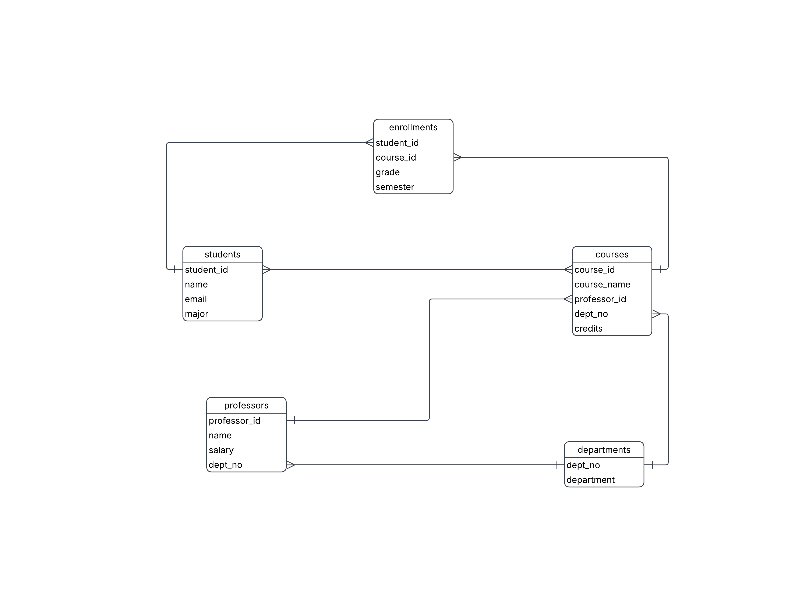
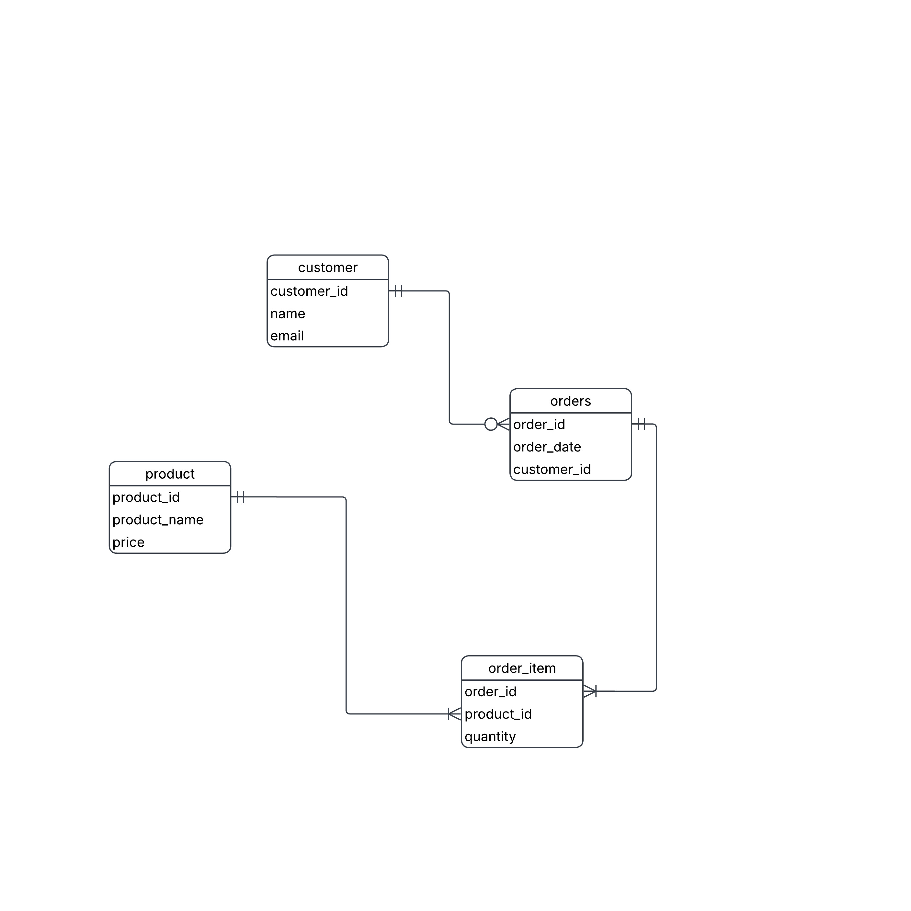

# Entity-Relationship (ER) Diagrams Using Crow's Foot Notation

## Learning Objectives

By the end of this lecture, you should be able to:

1. Explain the purpose of an ER diagram.
2. Identify entities, attributes, and relationships.
3. Interpret Crow's Foot cardinality symbols.
4. Design ER diagrams for real-world systems.
5. Convert business requirements into database structures.

## How to draw ?
You can make er diagrams using any of the following websites(I personally use lucidchart.io):
* draw.io
* erdplus
* pgadmin erd
* lucidchart.io
* draw it your self on a piece of paper

# 1. What is an ER Diagram?

An Entity-Relationship (ER) Diagram is a visual representation of a database.

It shows:

- What data is stored
- How different pieces of data relate to one another
- The rules governing those relationships

ER diagrams are commonly created during database design before any SQL tables are built.

---

## Example Scenario

Consider a university system:

- Students enroll in courses.
- Courses are taught by professors.
- Departments offer courses.

An ER diagram helps organize this information before creating database tables.

---

# 2. Basic Components

## Entity

An entity is an object or concept we want to store information about.

Examples:

- Students
- Courses
- Professors
- Departments

### Representation

Entities are drawn as rectangles.

+------------+ 
|  Student   | 
+------------+ 

---

## Attribute

An attribute is a property of an entity.

### Student Attributes

- StudentID (Primary Key)
- Name
- Email
- Major

---

## Primary Key (PK)

A primary key uniquely identifies each record.

**Examples:**
- StudentID
- CourseID
- EmployeeID

**Student:**
- StudentID (PK)
- Name
- Email

No two students can have the same StudentID.

---

## Foreign Key (FK)

A foreign key references the primary key of another table.

**Course(Example):**
- CourseID (PK)
- CourseName
- ProfessorID (FK)

ProfessorID points to a record in Professor.

---

# 3. Relationships

Relationships describe how entities interact.

Examples:

- Student enrolls in Course
- Professor teaches Course
- Customer places Order

---

# 4. Crow's Foot Notation

Crow's Foot notation is the most commonly used ER notation.

The symbols indicate cardinality.

Cardinality answers:

"How many instances of one entity can be associated with another?"

---

## Crow's Foot Symbols

### One

|

Means exactly one.

---

### Many

<

The "crow's foot" symbol represents many.

---

### Optional

O

Means zero is allowed.

---

# 5. Cardinality Types

## One-to-One (1:1)

Person |------| Passport

Meaning:

- One person has one passport.
- One passport belongs to one person.

### Example

**Person:**
PersonID (PK)

**Passport:**
PassportID (PK)
PersonID (FK)

---

## One-to-Many (1:M)

Most common relationship.

Department |------< Employee

Meaning:

- One department has many employees.
- Each employee belongs to one department.

### Example

**Department:**
DepartmentID (PK)
DepartmentName

**Employee:**
EmployeeID (PK)
DepartmentID (FK)

---

## Many-to-Many (M:N)

Student >------< Course

Meaning:

- Students take many courses.
- Courses contain many students.

### Problem

Relational databases cannot directly implement M:N relationships.

We need a bridge table.

---

# 6. Resolving Many-to-Many Relationships

Original relationship:

Student >------< Course

Convert to:

Student |------< Enrollment >------| Course

---

## Enrollment Table

**Enrollment:**
- StudentID (FK)
- CourseID (FK)
- Grade
- Semester

Now:

- One student has many enrollments.
- One course has many enrollments.

This resolves the M:N relationship.

## First example drawn out ER diagram 

# 7. Understanding Optionality

Crow's Foot notation also indicates whether participation is mandatory.

---

## Exactly One

||

Meaning:

- Must have one
- Cannot have zero
- Cannot have many

---

## Zero or One

O|

Meaning:

- May have none
- May have one

Example:

Employee O|------|| ParkingSpot

Not every employee gets a parking spot.

---

## One or Many

|<

Meaning:

- Must have at least one
- Can have many

Example:

Order ||------|< OrderItem

Every order contains at least one item.

---

## Zero or Many

O<

Meaning:

- May have none
- May have many

Example:

Customer O<------|| Order

A customer may not have placed any orders yet.

---

# 8. Reading Crow's Foot Relationships

Always read from one entity to another.

Example:

Department ||------O< Employee

Interpretation:

A department:

- Can have zero or many employees

An employee:

- Must belong to exactly one department

# 9. Example: Online Store

## Requirements

- Customers place orders.
- Orders contain products.
- Products can appear in many orders.

---

## Entities

### Customer
- CustomerID (PK)
- Name
- Email

### Order
- OrderID (PK)
- OrderDate
- CustomerID (FK)

### Product
- ProductID (PK)
- ProductName
- Price

### OrderItem
- OrderID (FK)
- ProductID (FK)
- Quantity

---

## ER Diagram

Customer ||------O< Order

Order    ||------|< OrderItem >|------|| Product

Interpretation:

- A customer may place many orders.
- Each order belongs to one customer.
- An order contains one or more products.
- A product may appear in many order items.

---

# 11. Strong vs Weak Entities

## Strong Entity

Has its own primary key.

Example:

Student
--------
StudentID (PK)

---

## Weak Entity

Cannot exist without another entity.

Example:

OrderItem
---------
OrderID
ProductID

OrderItem depends on Order.

---

# 12. Common Design Mistakes

## Mistake 1: Missing Primary Keys

Bad:

Student
--------
Name
Email

Good:

Student
--------
StudentID (PK)
Name
Email

---

## Mistake 2: Unresolved Many-to-Many Relationships

Bad:

Student >------< Course

Good:

Student |------< Enrollment >------| Course
