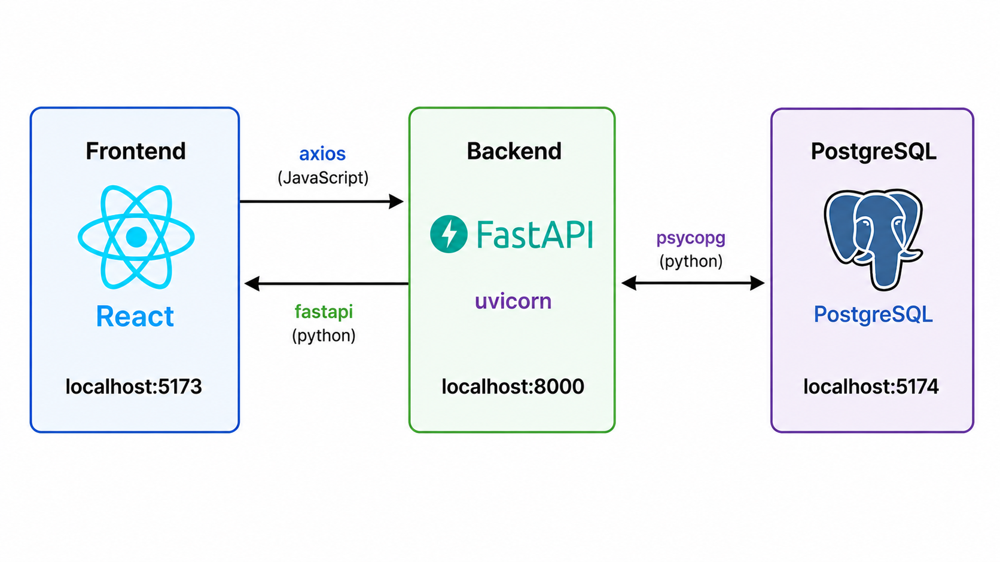

# Merging frontend + backend + psql

# Frontend Definition

A **frontend** is the part of a software application that **users directly interact with**. It is responsible for displaying information, receiving user input, and communicating those interactions to the backend.

## What the frontend does

- Displays the user interface (UI).
- Handles user interactions (clicks, typing, scrolling).
- Validates simple input (e.g., checking if an email field is empty).
- Sends requests to the backend (typically via HTTP APIs or WebSockets).
- Updates the interface with data received from the backend.

## Common frontend technologies

Frontends are commonly built using:

- HTML – Defines the structure of a webpage.
- CSS – Controls the appearance and layout.
- JavaScript or TypeScript – Adds interactivity and application logic.
- Frameworks and libraries such as React, Vue.js, Angular, and Svelte.

## Concise Definition

> **Frontend:** The client-side portion of an application that users see and interact with. It is responsible for presenting information, collecting user input, and communicating with the backend to access application data and services.


# Backend Definition

A **backend** is the part of a software application that **runs behind the scenes**, handling business logic, processing requests, managing data, and communicating with databases or other services. Users do not interact with it directly—they access it through the frontend.

## What the backend does

- Receives requests from the frontend.
- Executes application logic (business rules).
- Reads from and writes to databases.
- Authenticates and authorizes users.
- Communicates with external services or hardware.
- Returns responses to the frontend.

## Common backend technologies

Backends can be written in many languages and frameworks, including:

- Python (e.g., FastAPI, Django, Uvicorn)
- Java (e.g., Spring Boot)
- C# (e.g., ASP.NET Core)
- JavaScript/TypeScript (e.g., Node.js with Express)


## Concise Definition

> **Backend:** The server-side portion of an application that processes requests, executes application logic, manages data, communicates with databases and external systems, and provides services and data to the frontend.

# Software Architecture for login_project



## login_project Overview

This project is a simple full-stack application built for **user authentication (login/register)** and **time tracking (clock out system)**.
It allows employees to create an account with an email and password, then later they can login to their account to "clock in". When the employee is done with his shift he can press the "clock out" button, which will sign the employee out and log his work time. 

It uses:
- Backend: FastAPI (Python)
- Server: Uvicorn
- Frontend : React (running on http://localhost:5173)
- Database layer: Postgresql (handled inside `crud.py`)


# steps to get login_project to work
## Dependencies
* You can install docker and use dockerfile in [.devcontainer](../../.devcontainer/Dockerfile) and review [notes](../../notes/01_intro_psql/readme.md/)
* Install: node(for react), python and pip(then pip install uvicorn, fastapi, psycopg), postgresql 

## postgresql
1. ```cd ./notes/12_frontend_database/login_project/backend```
2. ```psql -h localhost -U postgres -f ./migration.sql```

## frontend 
1. ```cd ./notes/12_frontend_database/login_project/frontend```
2. ```npm i```
3. ```npm run dev```


# backend
1. In another terminal from frontend server:
2. ```cd ./notes/12_frontend_database/login_project/backend```
3. ```uvicorn app:app --reload```


# homework 3
1. Attached is a frontend project that has 5 buttons/tabs, clicking on one of these buttons will show one of your 5 tables, each button should display a different table(only 10 rows will be displayed at **random**). There will also be two other buttons, where you can add/remove a random row to one of your tables. This frontend already links to a backend file called main.py. If you prefer to use javascript as your backend, you are more than welcomed to, but you will have to make the apropriate changes to the frontend to get it to work. Attached is a dockerfile you can run that contains the dependencies in an isolated environment, alternatively you can install node on your computer(not too hard, and some of you already probably have it). Your task is to write a python script named main.py that connects the database you designed in project 2 to the frontend, shows the tables and performs the random adds and deletes. you must also use your script from project 2 to migrate your database to the frontend. 
2. simple database design in python. (probably not included, but we will still go over in class)